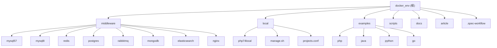

# CLAUDE.md

This file provides guidance to Claude Code (claude.ai/code) when working with code in this repository.

## 变更记录 (Changelog)

### 2026-05-07
- 初始化项目 AI 上下文
- 创建模块级 CLAUDE.md 文档（middleware, local, examples/*）
- 生成 Mermaid 模块结构图
- 添加模块索引表格和导航面包屑
- 创建 .claude/index.json 扫描索引

## 项目愿景

基于 Docker 的 Mac 开发环境，提供统一的中间件服务和多语言项目示例。通过 `shared-network` Docker 网络实现容器间通信，支持多种架构模式：

- **全容器化模式**: 所有服务和应用都在容器中（examples 模块）
- **混合模式**: 宿主机中间件 + 容器 PHP-FPM（local 模块）
- **中间件共享模式**: 统一的中间件服务供所有项目使用（middleware 模块）

## 架构总览

### 网络架构

所有容器通过 `shared-network` Docker 网络互联，实现服务发现和通信：

```
┌──────────────────────────────────────────────────────┐
│              shared-network (Docker Bridge)           │
├──────────────────────────────────────────────────────┤
│                                                       │
│  ┌──────────┐  ┌──────────┐  ┌──────────┐            │
│  │  mysql57 │  │  mysql8  │  │  redis   │            │
│  └──────────┘  └──────────┘  └──────────┘            │
│                                                       │
│  ┌──────────┐  ┌──────────┐  ┌──────────┐            │
│  │ postgres │  │ rabbitmq │  │ mongodb  │            │
│  └──────────┘  └──────────┘  └──────────┘            │
│                                                       │
│  ┌──────────────┐  ┌──────────────┐                  │
│  │ elasticsearch│  │    nginx     │                  │
│  └──────────────┘  └──────────────┘                  │
│                                                       │
│  ┌──────────┐  ┌──────────┐  ┌──────────┐            │
│  │ php-app  │  │ java-app │  │ python   │            │
│  │(examples)│  │(examples)│  │(examples)│            │
│  └──────────┘  └──────────┘  └──────────┘            │
│                                                       │
└──────────────────────────────────────────────────────┘
```

### 架构模式对比

| 模式 | 适用场景 | 特点 | 模块 |
|------|----------|------|------|
| 全容器化 | 示例/演示 | 服务名连接，完全隔离 | examples |
| 混合模式 | 本地开发 | 宿主机 Nginx，容器 PHP | local |
| 中间件共享 | 多项目开发 | 统一中间件，资源复用 | middleware |

## 模块结构图 (Mermaid)



## 模块索引

| 模块路径 | 职责 | 语言 | 入口 | 文档 |
|---------|------|------|------|------|
| [middleware](./middleware/CLAUDE.md) | 公共中间件服务（MySQL/Redis/PostgreSQL/RabbitMQ/ES/MongoDB/Nginx） | Docker Compose | docker-compose.yml | [查看](./middleware/CLAUDE.md) |
| [local](./local/CLAUDE.md) | PHP 本地开发环境（宿主机 Nginx + 容器 PHP-FPM） | Shell/Dockerfile | manage.sh | [查看](./local/CLAUDE.md) |
| [examples/php](./examples/php/CLAUDE.md) | PHP 8.2 示例项目 | Docker Compose | docker-compose.yml | [查看](./examples/php/CLAUDE.md) |
| [examples/java](./examples/java/CLAUDE.md) | Java (JDK 17) 示例项目 | Docker Compose | docker-compose.yml | [查看](./examples/java/CLAUDE.md) |
| [examples/python](./examples/python/CLAUDE.md) | Python 3.12 示例项目 | Docker Compose | docker-compose.yml | [查看](./examples/python/CLAUDE.md) |
| [examples/go](./examples/go/CLAUDE.md) | Go 1.21 示例项目 | Docker Compose | docker-compose.yml | [查看](./examples/go/CLAUDE.md) |

## 目录结构

```
docker_env/
├── middleware/              # 公共中间件
│   ├── docker-compose.yml   # 主编排文件
│   ├── .env.example         # 凭据模板
│   ├── mysql57/             # MySQL 5.7 配置与数据
│   ├── mysql8/              # MySQL 8 配置与数据
│   ├── pgsql/               # PostgreSQL 数据
│   ├── redis/               # Redis 配置与数据
│   ├── rabbitmq/            # RabbitMQ 数据
│   ├── mongo/               # MongoDB 数据
│   ├── elasticsearch/       # Elasticsearch 配置与数据
│   └── nginx/               # Nginx 配置
│   └── CLAUDE.md            # 模块文档
├── local/                   # PHP 本地开发环境
│   ├── manage.sh            # 项目管理脚本
│   ├── projects.conf        # 项目配置列表
│   ├── php74local/          # PHP 7.4 Dockerfile 与配置
│   ├── README.md            # 使用说明
│   ├── NGINX-CONFIG-GUIDE.md # Nginx 配置指南
│   └── CLAUDE.md            # 模块文档
├── examples/                # 各语言项目示例
│   ├── php/
│   ├── java/
│   ├── python/
│   └── go/
│   └── */CLAUDE.md          # 各模块文档
├── scripts/                 # 工具脚本
│   ├── init-network.sh      # 网络初始化
│   └ git-proxy-push.sh      # Git 推送脚本
├── docs/                    # 文档
├── article/                 # 文档文章（Obsidian 笔记库）
├── .spec-workflow/          # Spec 工作流模板
├── .claude/                 # Claude AI 配置
│   ├── index.json           # 扫描索引
│   └ settings.local.json    # 本地设置
└── CLAUDE.md                # 本文件
```

## 运行与开发

### 快速开始

#### 1. 初始化配置

```bash
cd middleware
cp .env.example .env     # 复制环境变量模板
# 根据需要修改 .env 中的密码
```

#### 2. 初始化网络

```bash
# 方法 1：使用脚本
./scripts/init-network.sh

# 方法 2：手动创建
docker network create shared-network
```

#### 3. 启动中间件

```bash
cd middleware
docker-compose up -d           # 启动所有中间件
docker-compose down            # 停止所有中间件
docker-compose logs <service>  # 查看服务日志
docker-compose ps              # 查看运行状态
```

#### 4. 启动示例项目

```bash
cd examples/<php|java|python|go>
docker-compose up -d
docker-compose down
```

#### 5. PHP 多项目管理（local）

```bash
cd local
./manage.sh                    # 交互式菜单
./manage.sh start              # 启动所有项目
./manage.sh start <container>  # 启动指定项目
./manage.sh stop               # 停止所有项目
./manage.sh status             # 查看状态
./manage.sh logs <container>   # 查看日志
```

### 中间件服务端口

| 服务 | 容器名 | 宿主机端口 | 容器内连接 | 认证 |
|------|--------|------------|-----------|------|
| MySQL 5.7 | mysql57 | 127.0.0.1:3307 | `mysql57:3306` | 见 .env |
| MySQL 8 | mysql8 | 127.0.0.1:3308 | `mysql8:3306` | 见 .env |
| PostgreSQL | postgres | 127.0.0.1:5432 | `postgres:5432` | 见 .env |
| Redis | redis | 127.0.0.1:6379 | `redis:6379` | 密码认证 |
| RabbitMQ | rabbitmq | 127.0.0.1:5672, 127.0.0.1:15672 | `rabbitmq:5672` | 见 .env |
| Elasticsearch | elasticsearch | 127.0.0.1:9200, 127.0.0.1:9300 | `elasticsearch:9200` | 密码认证 |
| MongoDB | mongodb | 127.0.0.1:27017 | `mongodb:27017` | 见 .env |
| Nginx | nginx | 127.0.0.1:80, 127.0.0.1:8080 | `nginx:80` | - |

> 所有端口仅绑定到 127.0.0.1，确保本地开发安全。
> 凭据统一通过 `middleware/.env` 管理。

### 连接示例

#### 容器内项目访问中间件

使用服务名连接：

```php
// PHP 连接 MySQL
$pdo = new PDO('mysql:host=mysql57;port=3306;dbname=default', 'devuser', 'devpassword');

// PHP 连接 Redis（需密码）
$redis = new Redis();
$redis->connect('redis', 6379);
$redis->auth('devredis123');
```

#### 容器访问宿主机服务

使用 `host.docker.internal`：

```php
$redis->connect('host.docker.internal', 6379);  // 宿主机 Redis
$redis->auth('devredis123');
```

#### Java (Spring Boot) 连接 MySQL

```properties
spring.datasource.url=jdbc:mysql://mysql8:3306/default?useSSL=false
spring.datasource.username=devuser
spring.datasource.password=devpassword
```

#### Python 连接 PostgreSQL

```python
from psycopg2 import connect
conn = connect(
    host='postgres',
    port=5432,
    database='default',
    user='devuser',
    password='postgres123456'
)
```

## 测试策略

当前项目为基础设施配置项目，测试策略主要关注：

1. **服务健康检查**: 所有中间件配置了 Docker 健康检查
2. **容器状态验证**: 使用 `docker-compose ps` 检查服务状态
3. **连接测试**: 各示例项目提供连接测试代码
4. **资源限制**: 配置内存限制防止资源耗尽

建议添加：
- 自动化集成测试脚本
- 服务监控配置（Prometheus/Grafana）
- 备份恢复脚本

## 编码规范

### Docker Compose 规范

- 所有端口绑定到 `127.0.0.1`
- 使用 `.env` 文件管理凭据
- 配置健康检查和资源限制
- 日志使用 `json-file` driver，限制大小

### Shell 脚本规范

- 使用 `set -e` 或 `set -euo pipefail`
- 添加颜色输出和错误处理
- 提供交互式和命令行两种模式
- 函数命名清晰，添加注释

### 配置文件规范

- 使用 UTF-8 编码
- 添加配置说明注释
- 遵循各服务的最佳实践
- 配置文件在启动前创建

## AI 使用指引

### 模块导航

- 根级文档提供全局视图和架构概览
- 各模块 CLAUDE.md 提供详细配置和 FAQ
- 使用面包屑导航快速定位

### 扫描覆盖

根据 `.claude/index.json`：

- 估算总文件数：500+
- 已扫描文件数：45
- 覆盖率：约 9%
- 主要扫描了配置文件、脚本和文档

### 未覆盖区域

- middleware/*/data/ 数据文件（已忽略）
- article/ Obsidian 笔记库（约 200+ 文件）
- examples/*/src/ 源代码（当前为空）
- .playwright-* 临时文件

### 下一步建议

1. 为 examples 各语言添加示例源代码
2. 添加自动化测试脚本
3. 完善 local 模块 PHP 8.2+ 支持
4. 添加服务监控和备份脚本

## 配置文件

| 文件 | 用途 | 说明 |
|------|------|------|
| middleware/.env | 凭据配置 | 不入库，需从 .env.example 复制 |
| middleware/.env.example | 凭据模板 | 默认密码，可修改 |
| middleware/docker-compose.yml | 中间件编排 | 主配置文件 |
| local/projects.conf | PHP 项目配置 | 定义项目列表 |
| local/php74local/Dockerfile | PHP 镜像构建 | 包含扩展和配置 |
| middleware/*/conf/* | 各服务配置 | MySQL/Redis/Nginx 等 |

## Mac 特定配置

- MySQL 5.7 需要 `platform: linux/amd64` 支持 M1/M2/M3
- 推荐启用 VirtioFS 优化文件共享性能
- 日志和数据持久化在 `middleware/<service>/data` 目录
- 使用 Docker Desktop 管理容器

## Deprecation 警告

- **PHP 7.4**: 已于 2022年11月 EOL，仅用于遗留项目，新项目请用 PHP 8.2+

## 常见问题

### 容器无法启动

1. 检查 Docker Desktop 是否正常运行
2. 检查端口是否被占用：`lsof -i :3307` 等
3. 查看容器日志：`docker-compose logs <service_name>`

### 配置文件未生效

确保在 `docker-compose up` 之前已创建好配置文件，否则 Docker 会将挂载路径创建为空目录。

### 网络不通

1. 确认 `shared-network` 已创建：`docker network ls`
2. 确认容器都加入了同一网络：`docker network inspect shared-network`
3. 项目内使用服务名（如 `mysql57`）而非 `localhost`

### Elasticsearch 启动失败

1. 检查内存设置（`.env` 中的 `ES_JAVA_OPTS`）
2. 如需重置密码，清空 `elasticsearch/data/` 目录后重启

### 数据清理

删除对应服务的 `data` 目录会清空数据：

```bash
rm -rf middleware/mysql57/data/*
docker-compose restart mysql57
```

## 相关链接

- [middleware 模块文档](./middleware/CLAUDE.md)
- [local 模块文档](./local/CLAUDE.md)
- [examples/php 模块文档](./examples/php/CLAUDE.md)
- [examples/java 模块文档](./examples/java/CLAUDE.md)
- [examples/python 模块文档](./examples/python/CLAUDE.md)
- [examples/go 模块文档](./examples/go/CLAUDE.md)