# 换了N个笔记工具，最终我还是选择了 Obsidian

---

**作者**: 技术爬爬虾

**原文链接**: https://mp.weixin.qq.com/s?__biz=MzkyNTU5MTQxOQ==&mid=2247487117&idx=1&sn=e98ef823642d993492849ee8f5ad864e&chksm=c062c7769d71e1ad9beb9f05dc879e4c5884ef2f8593d7a726ddfa6e2a9b9b21cf9803634256&mpshare=1&scene=1&srcid=0419L9fopNX0xLKiKRDHd6CI&sharer_shareinfo=dad99707db34af1999e9c91eb7cb77b3&sharer_shareinfo_first=dad99707db34af1999e9c91eb7cb77b3#rd

---

## 📝 文章总结

> 💡 **提示**: 这里可以添加文章总结或关键要点

---

这两年我换了N个笔记工具，最终我还是选择了 Obsidian。我有三个必须使用 Obsidian 的理由：

### 数据安全

Obsidian 里面所有的笔记，本质上都是本地电脑上的一个个独立的 Markdown 文件。这意味着，即使 Obsidian 的开发者跑路了，这些笔记也不会丢失，换一个 Markdown 编辑器继续使用就好了。这种安全感，是任何一个云端笔记软件都给不了的。同时，我还用 GitHub 对笔记进行了云端同步备份。GitHub 作为世界上最大的源代码托管平台，已经成为了计算机科学的基础设施之一了。笔记备份在里面，比存在任何一个云笔记、网盘里面都要安全稳定。

### 界面丝滑流畅

Obsidian 的第二大优势就是 UI 的速度快。我之前用的笔记软件，切换笔记差不多要白屏一秒，打开新窗口等操作，更是肉眼可见的卡顿。这种卡顿，其实很破坏专心工作时的心流。自从换了 Obsidian，就再也感觉不到任何卡顿了，这简直就是笔记界的🍫，丝滑稳定。

### 与 AI 工具是绝配

Obsidian 的第三大优势，就是跟 AI Agent 是绝配。比如 Claude Code、Gemini CLI 这种 AI 编程工具，天生就很擅长处理本地文件，特别是处理 Markdown 格式的笔记文件。使用 Obsidian 加 AI，可以搭配出各种神奇的用法，比如让 AI 帮我查找笔记、整理文件夹、模仿我的文风写作，或者根据我的视频思路，想一些爆款选题等等。本期视频，我会从云同步、图片存储、手机端使用，还有 AI 玩法等各个角度，介绍下我最近是怎么使用 obsidian 的。全套的工具都是免费的，不用花一分钱。我的 obsidian 的用法，可能有点偏向程序员、偏向极客，但是这些工具组合起来，完美解决了我的需求，我认为很有价值，分享一下。话不多说，我们直接开始。

视频版：

## 免费云同步

Obsidian 比起那些云笔记软件，可能最缺失的功能就是云同步。我选择的云同步方案是 GitHub。首先 GitHub 完全免费，而且 GitHub 已经成为了计算机科学的基础设施之一了。文件存储在 GitHub 里面，比任何一种网盘云笔记都要安全稳定。我们先注册并且登录一下 GitHub。如果遇到 GitHub 网速慢打不开，可以在微软应用市场安装Watt ToolKit工具，解决 GitHub 的网络问题。

我们来到

https://github.com/new

创建一个 repository，也就是存储库。

这里我给仓库起个名字，叫 shrimp_vault。 注意下面的 visibility，也就是仓库的可见性。 如果你不想把你的笔记公开到互联网上面，这里一定要选择 private，也就是私有仓库。

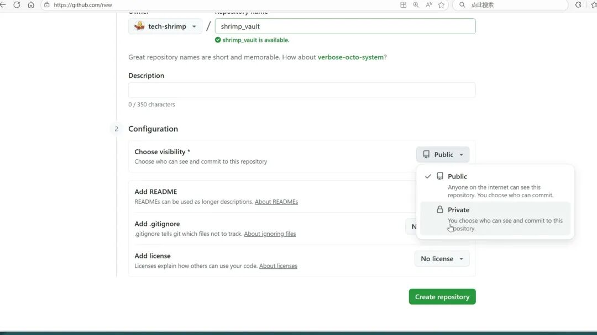最后点击创建。 这样我们一个存储库就在 GitHub 上面创建好了。

接下来我们要做的，就是把这个仓库克隆到电脑上面。接下来，我们下载一个 GitHub 的桌面客户端工具，就是 GitHub Desktop。

我们需要先安装Git命令行工具：

https://git-scm.com/

然后安装Github桌面客户端软件：

https://github.com/apps/desktop

这个客户端都是傻瓜式的操作，对新手非常友好。如果你会使用命令行来操作 Git 的话，可以不下载这个客户端。我们打开客户端以后，左上角找到 File，点击克隆仓库，也就是把 GitHub 的远程仓库克隆一份到自己的电脑上。

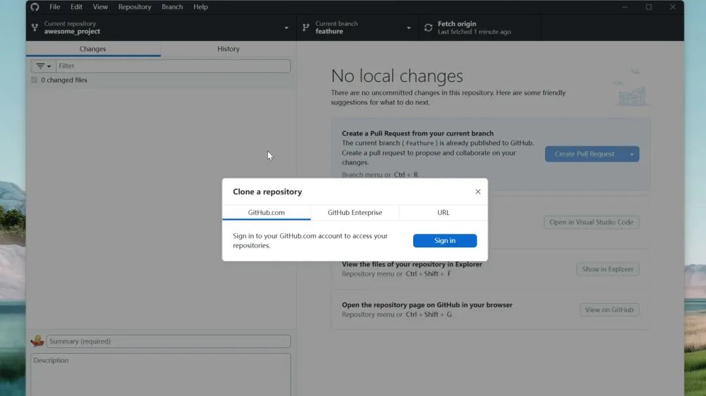这里需要先登录一下 GitHub 的账号，点击 Sign In 浏览器登录，点击确认。 登录完成以后，就可以搜索到我们的仓库，然后在下面选择一个路径，点击克隆。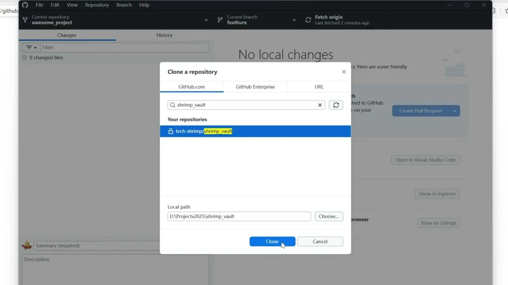

这样，我们就把 GitHub 上面的一个远程仓库克隆到了本地，变成了一个文件夹。

接下来我们打开 Obsidian 软件，选择打开本地仓库，打开，找到克隆下来的本地文件夹，选择文件夹。

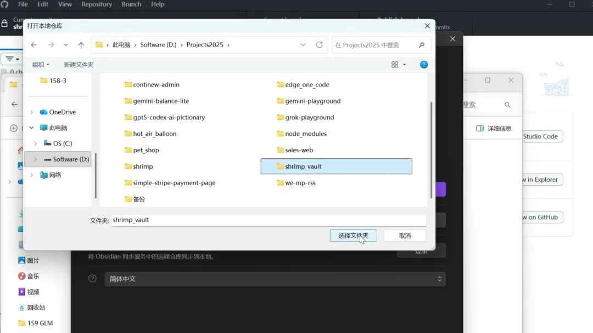打开以后就可以创建笔记，我们每创建的一个笔记，就是一个 Markdown 格式的文件。这个文件，就会出现在我们的仓库文件夹里面。这个 .obsidian 文件夹是它的配置文件夹，里面的这些文件存放了关于 Obsidian 的配置。

接下来还有一个重要步骤，我们要把这个 `workspace.json` 从 git 管理的文件里面排除出去，也就是不上传到 Github 上面。这个文件记录了当前工作区的状态，比如打开了哪些笔记，还有当前的页面布局等等。它会被频繁地修改，如果把它上传到 git 上面，很容易造成冲突。这里我们来到仓库的根目录，新建一个文件，文件的名字叫做 `.gitignore`。

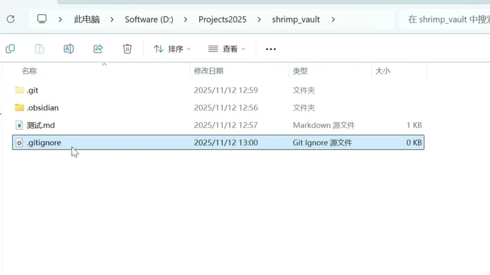然后我们来编辑一下这个文件，在这里面添加这么两行，把这两个文件排除出去，不要上传到 GitHub 上面。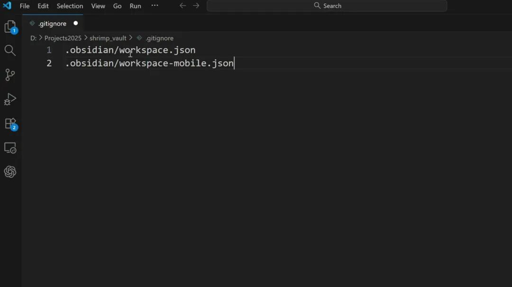然后我们回到 GitHub Desktop，选中这5个文件，在下面填一个描述，点击 commit。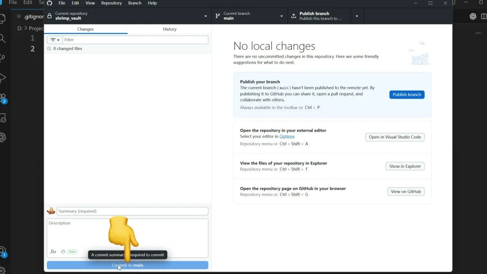然后再点击 publish 按钮，这样，我们本地的笔记就上传到 GitHub 上面了。 我们来到 GitHub 的网页端看一下，这边同步显示了我们创建的笔记。这样，我们就把我们电脑上的本地笔记库跟 GitHub 做了一个云同步，并且备份到了 GitHub 上面。在我们的这一套操作里面，每次修改完笔记都需要手动提交一次，这么操作下来还是挺麻烦的。我们可以借助一个插件，让 Obsidian 自动化的操作，省去这个手动提交的步骤。我们回到 Obsidian，找到这个齿轮，也就是设置，选到第三方插件，关闭安全模式。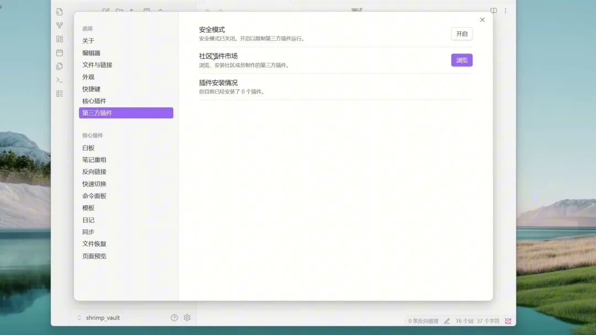然后，我们就可以在社区插件市场里面安装插件。这里我搜索的插件名字就叫做 git，把这个插件安装一下，然后点击启用。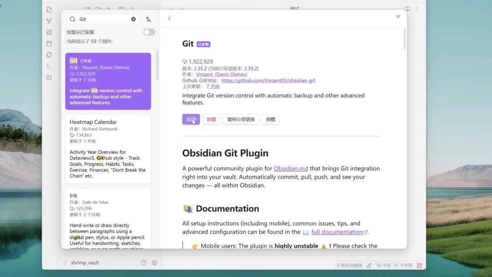点击选项进来以后，我一般会修改几个选项。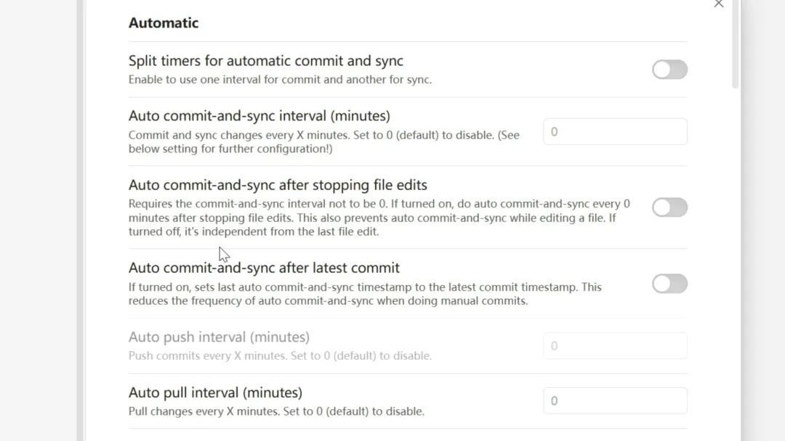首先是这个 `auto commit and sync after stopping file edits`，也就是当我们停止编写笔记的时候，他就会尝试自动往 GitHub 上面同步一次。 然后上面的分钟数也需要改一下，这里我改成1。 当我们停止编写文件1分钟以后，Obsidian 就会自动往 Github 上面提交一次。下面还有一个选项，建议开启，就是这里的 Pull on start。 每当我们启动 Obsidian 的时候，先去 Github 上面 pull 一下，看看有没有新的改动，保持我们的本地文件跟 Github 上面的同步。

这里我来测试一下，我随便写一句话，然后等待1分钟。右上角出现了一个小弹窗表示，进行过了自动同步。 我们看到这句话，就已经出现到了远端仓库。 当然我们也可以直接从 Github 上面对这个仓库进行修改。比如这里，我点击 Add File 创建一个新的文件，这个文件是 Markdown 格式的，提交上去。 这样我们在远端仓库进行了修改，并且创建了文件。我们在 Obsidian 这边设置了自动同步，每次间隔一分钟，或者每次重启 Obsidian 的时候，我们看到右上角有一个自动同步。 这样我们在远端创建的文件，也自动同步到了本地。

除了使用 Github 进行云备份，我们也可以把 Obsidian 的笔记文件夹定时备份到网盘，或者备份到硬盘里面进行冷备份。组合这些策略可以保证我们的笔记永不丢失。

## Obsidian + AI

Obsidian 本身并不提供任何的 AI 功能。我们有两条路可以把 obsidian 接入 AI：Plan A 是用社区的 AI 插件；Plan B 则是用 AI 编程工具，比如 Claude Code， Codex 或者 Gemini CLI 等等。

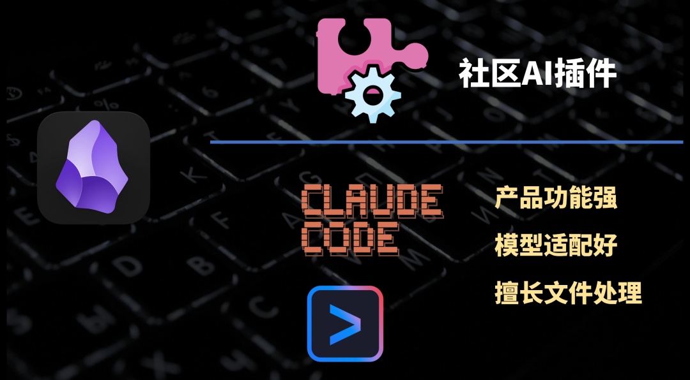

这里我推荐使用 AI 编程工具。首先，这些 AI 编程工具都是一线大厂出品的，在产品功能以及 AI 模型的适配度上，肯定要好于社区插件。AI 编程工具与文件系统的交互是他们的核心能力，所以，他们处理一个个 Markdown 格式的笔记会非常的得心应手。

这里我就用 Gemini CLI 为例，来展示一下 Obsidian 组合 AI 的各种玩法。因为 Gemini CLI 是完全免费的，而且我觉得 Gemini 的文风跟我是最像的，最适合帮我写笔记了。在开始之前，我们需要先把 Node.JS 安装一下。来到 Node.JS 的官网，找到对应操作系统的安装包安装即可。

https://nodejs.org/zh-cn

然后我们来到 Gemini CLI 的官网，把它的安装命令复制一下。

    npm install -g @google/gemini-cli

我们来到 Obsidian 的笔记目录，右键在终端打开，然后把 Gemini CLI 的安装命令粘贴进来，回车安装完成。 我们输入命令 `gemini`，把 Gemini CLI 启动起来。选择上面的 Login with Google，这里需要你的电脑有海外的上网环境。 这里我授权一下，这样就配置完成。

我们来看第一个案例： > 自媒体存档这个文件夹里面存的是我这三年写过的所有视频的脚本，请根据我的选题特色与观众喜好，调用网络搜索工具来搜索热点，用你丰富的知识，探寻我没有做过的选题，帮我再写10个选题。你输出一个《选题.md》文件放到当前项目的根目录下面，每个选题都应该有对应的简介与大纲。

我们开始。AI 帮我们完成了选题文件的编写，我们来看一下。

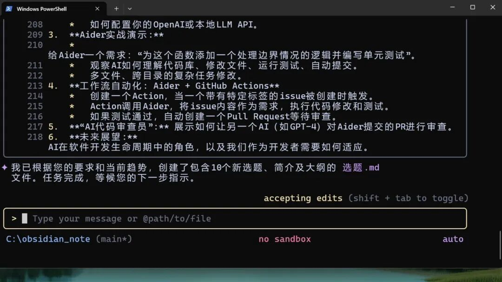

AI给了以下几个选题：

  1. 1\. 本地运行大模型用 Ollma 还有 LM Studio
  2. 2\. Cloudflare 的骨灰用法
  3. 3\. 搭建私人网盘
  4. 4\. 打造云端开发环境
  5. 5\. 自建密码管理器
  6. 6\. 开源工作流 n8n

Gemini 生成的这个笔记，总体来说还是很不错的，确实能给我一些启发。

我们再来看一个例子： 你把这10个选题建出子文件夹，所有的子文件夹都放到根目录/未来选题这个里面。每个子文件夹里面都有一份选题大纲文件。做完以上工作，就把根目录的《选题.md》这个删除掉。

这一步考验的就是 AI 工具批量处理文件的能力。好，我们的 AI 完成了工作，我们再来看一下。 我们看到多了一个未来选题文件夹，然后这下面又建了10个子文件夹，每个子文件夹都存放了一个选题的大纲。任务完成得相当不错。

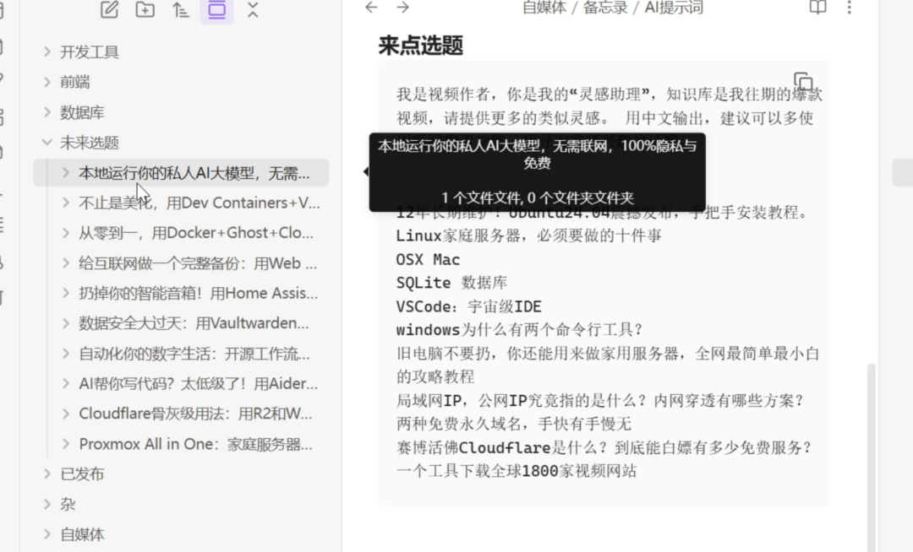

我们再来看一个案例： 我最近看到一篇文章叫做《忘了 n8n 吧，我用国产模型跑通了 Claude Skill》，这个文章很不错。你搜索下文章的内容，然后根据我的行文风格写一个视频脚本，需要详细一些，脚本放到根目录即可。行文风格可以参考我2024年与2025年的往期内容。

这样开始。我们看到，Gemini 帮我搜索到了这篇文章。

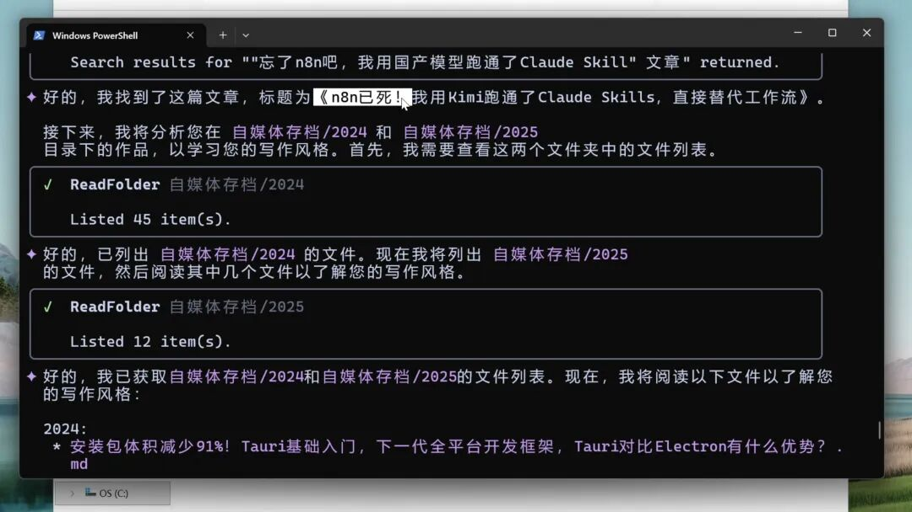我虽然标题记错了，他还是帮我搜索到了，表现不错。然后 Gemini 从我之前的笔记里面，学习我的写作风格。AI 帮我完成了脚本的编写，视频开场，然后还给我分了章节，包括怎么实战、怎么配置、怎么编写代码。总体结构还是很像我的视频风格的，不过他的行文用词比较夸张，这里只能参考他的框架，里面的内容还得重新调整一番。

如果你担心 AI 把你的文件夹搞乱，把一些重要的文件搞丢，其实这个也不用担心。我们使用 git 把每一次的文件修改，其实都已经记录下来了。如果你对 AI 的修改不满意，我们可以直接右键选择 discard changes，直接把仓库的状态还原到 AI 的修改之前。

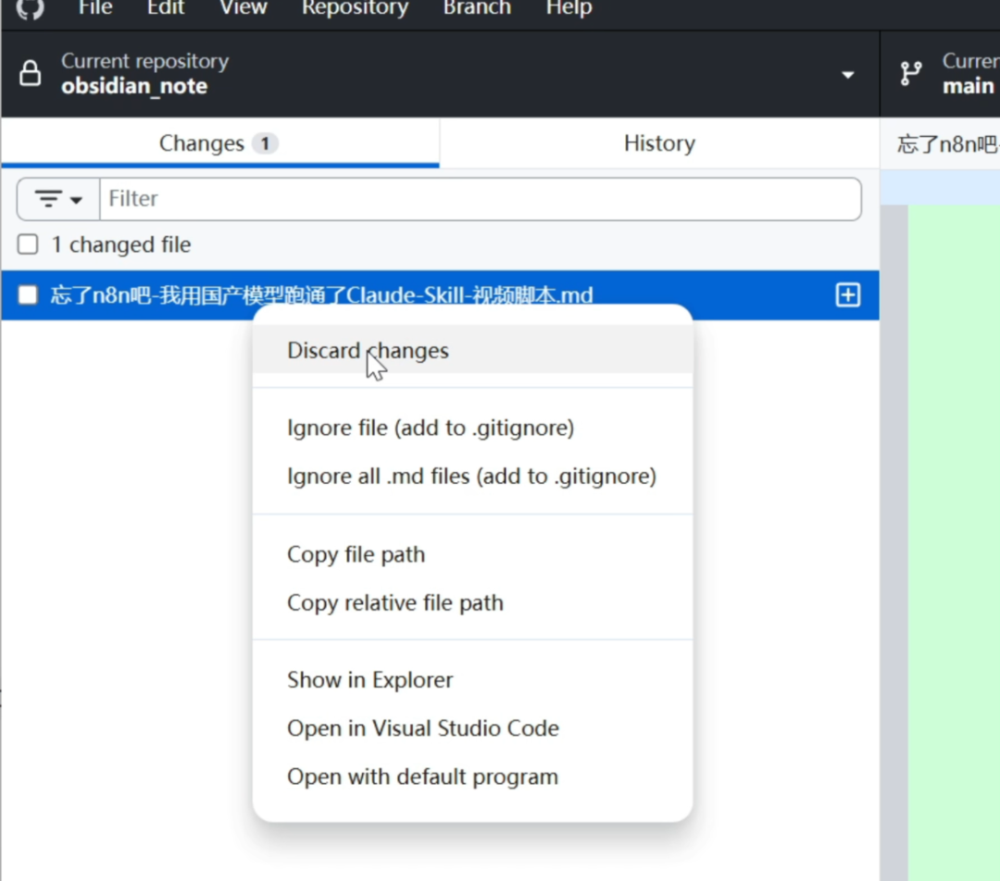

我们使用 Git，每一次的历史提交都有记录，所以我们可以放心大胆的让 AI 进行修改，不用担心 AI 搞丢或者搞坏文件。

## 图片与附件

Obsidian 本身是有图片存储功能的，但是我觉得它并不好用。我们来测试一下，这里我给 GitHub 仓库截一张图，然后我们来到 Obsidian 粘贴上。 我们看到，他把图片放到了跟笔记同级别的一个目录下面。

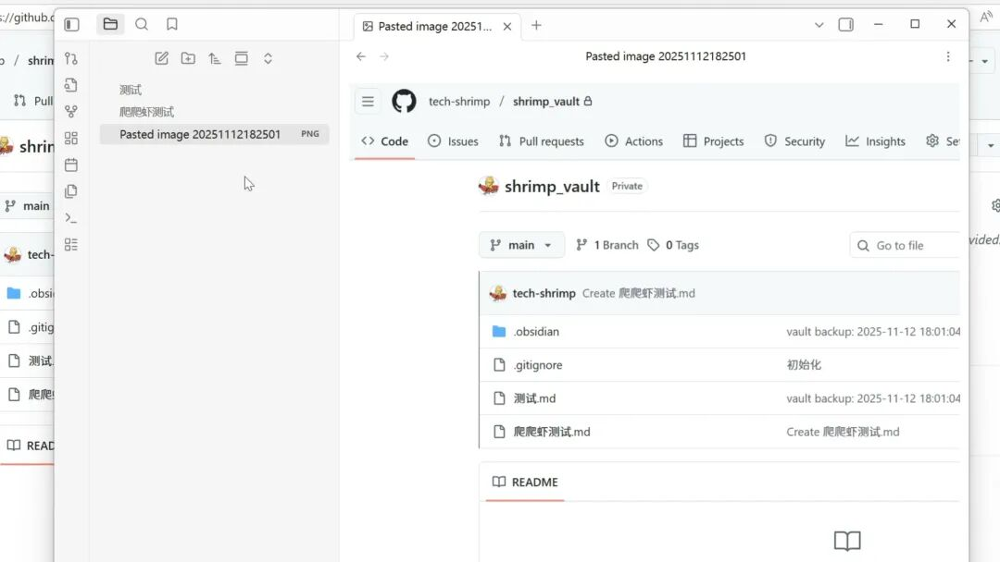这样图片一多，整个目录文件夹都会变得很乱。第二个问题是，他这里的图片链接，并不是标准的 Markdown 语法，不能使用别的软件读取。 我们来看一下，这里正好它已经自动同步到 GitHub 上面了，图片插入的不是标准的 Markdown 格式，所以在 GitHub 的网页端，没法对这个图片成功地显示出来。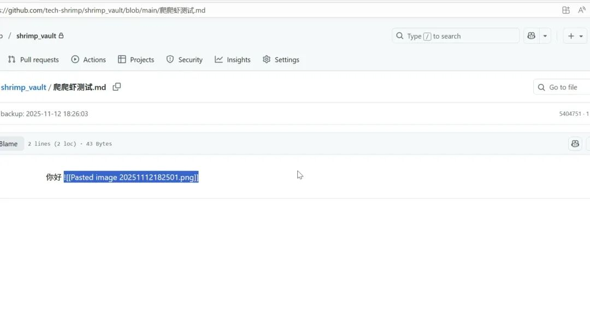包括我用 VS code 打开这个文件，点击 Ctrl+Shift+V 预览一下这个 Markdown，它也没法成功地渲染。

这里我要借助一个插件，把我们的图片格式，标准成一个 Markdown 的语法。我先把原来的图片都删除掉。然后我们找到设置，还是第三方插件，社区插件市场，浏览，我们搜索这个插件 Custom attach location，也就是自定义附件存储位置。

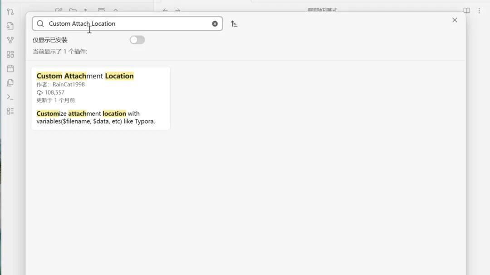把它安装一下，启用起来。点击设置，这里我们主要修改 Markdown URL 格式，填写上这一串。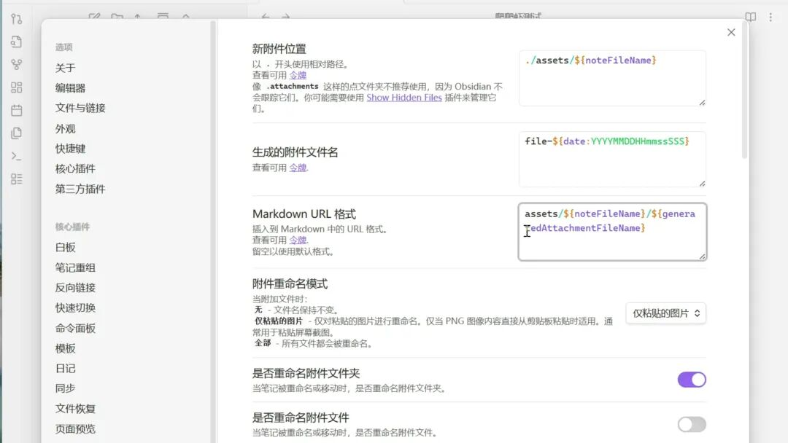附件重命名模式，选择全部。接下来是否重命名附件文件，这个也勾选上。好，这样插件就配置完成。

然后我们再来到 Obsidian 的设置，找到系统设置里面的文件与链接，注意把这个“使用 Wiki 链接”取消掉。

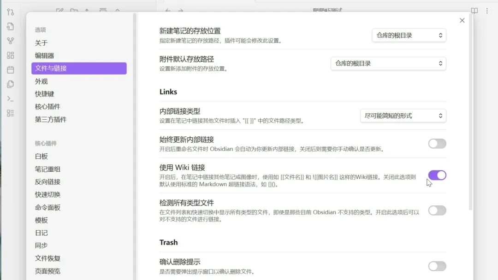上面的内部链接类型，选择“基于当前笔记的相对路径”。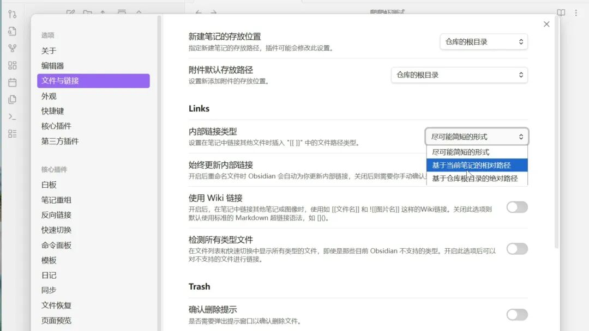好，这样就配置完成。我们再来试一下，我在网页上随便截一个图，然后 Ctrl+V 把附件粘贴过来。我们看到，Obsidian 为我们生成了一个 assets 文件夹，这个文件夹里面，创建了一个跟我笔记同名的子文件夹，然后他把图片附件都放到了这个下面。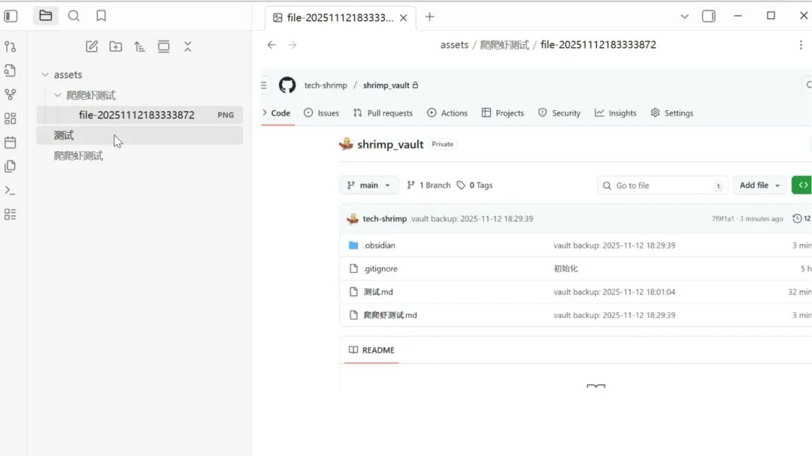当我们对笔记进行重命名的时候，附件的子文件夹也进行了重命名，这里的图片链接也自动进行了更新。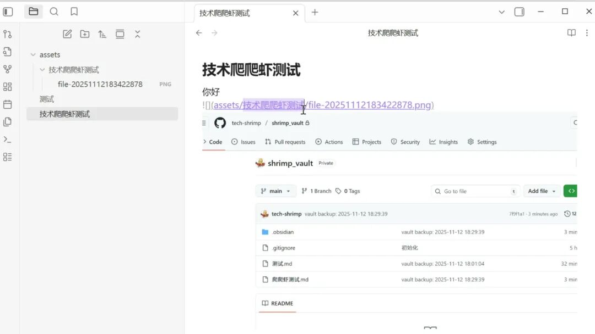

我们这种新的图片引用方式，它是符合 Markdown 语法的。 这里我从 VS Code 试一下，我们打开它的预览，可以看到图片可以正常显示。 包括我们在 GitHub 的网页端查看笔记的时候，图片也可以正常地显示。 这里我创建一个文件夹叫“计算机知识”，然后我把我的笔记直接挪动到这个文件夹里面。我们看到，附件文件夹也相应的进行了目录调整。

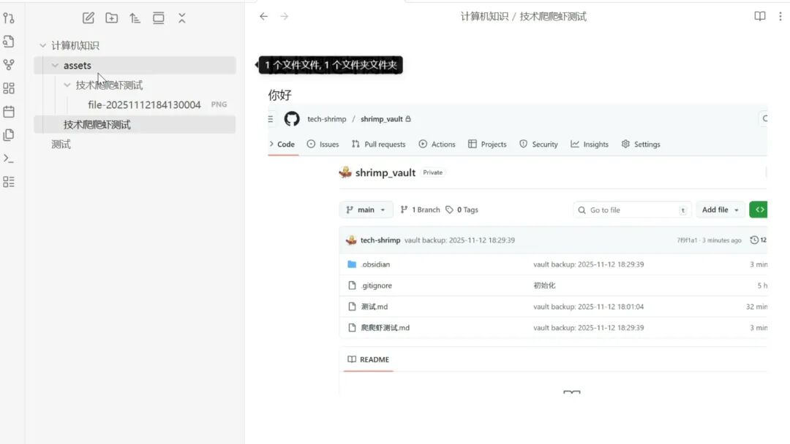使用这个插件，可以让附件的存储位置变得非常的整洁，很方便我们进行整理。

这里还有一个技巧，如果我们觉得这个图片太宽了，可以直接在这个方括号里面输入数字，来调整这个图片的大小。

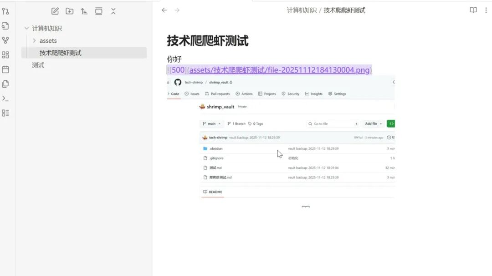我们这一套图片存储方案，充分利用了 Markdown 的标准语法与目录结构，并且没有使用第三方云图床。云图床肯定不如本地图片安全、隐私、稳定，而且使用云图床可能会产生费用。我们这套本地存储的方案，完美解决了这些问题。

## 手机端配置与同步

手机也可以使用 Obsidian，当然也可以使用 GitHub 进行云同步。我们先弄一根数据线，把手机跟电脑连接起来，然后选择传输文件。我们回到电脑上，找到手机的存储设备，这里我以我自己的安卓手机为例。 这里我建议使用 Documents 这个文件夹。然后，我们把电脑上的 obsidian 笔记文件夹直接复制一份，粘贴到手机里面。

接下来的操作我们需要在手机上进行。这里打开手机上的 Obsidian，点选择 Open Folder as vault，选择我们复制进来的文件夹，点击“使用此文件夹”，允许。

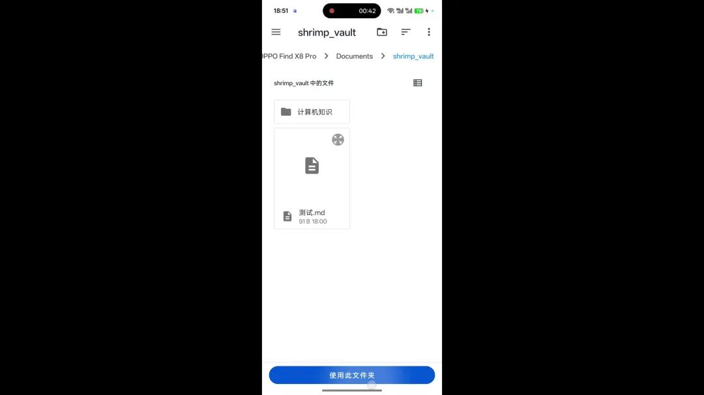这里选择第一个 trust author。这样我们的基础配置就完成了。我们可以看到里面的笔记，包括查看图片都没有问题。

接下来我们配置云同步。点击左上角的按钮，然后右上角的设置，我们找到最下面的 Git 的设置。

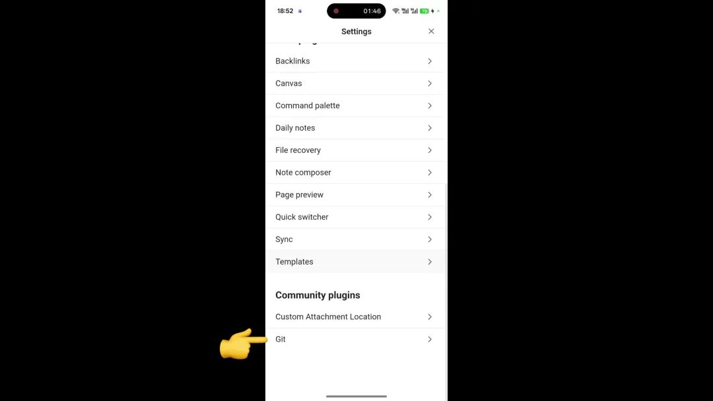这里需要填写我们在 GitHub 上面的英文名字，我的英文名字是 tech-shrimp。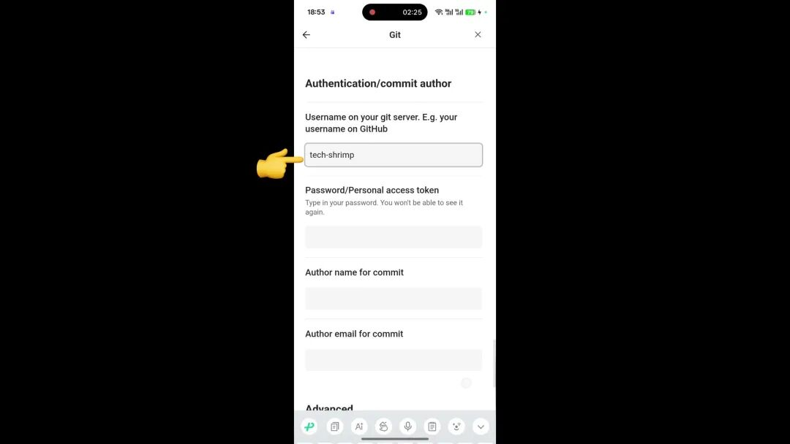填写好英文名字，把它复制一下，下面也填写一下英文名字。然后填写你在 GitHub 上面的注册邮箱。最后要填写的，就是我们在 GitHub 上面的 Personal access token。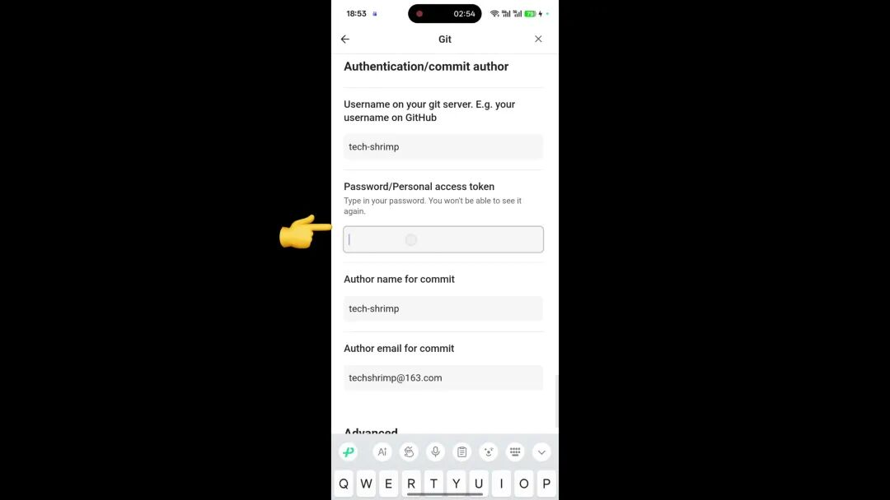我们回到电脑端Github，右上角找到 Settings，在下面有一个 Developer Settings，这里找到 Personal access tokens (classic)，创建一个新的 TOKEN，选择创建 classic。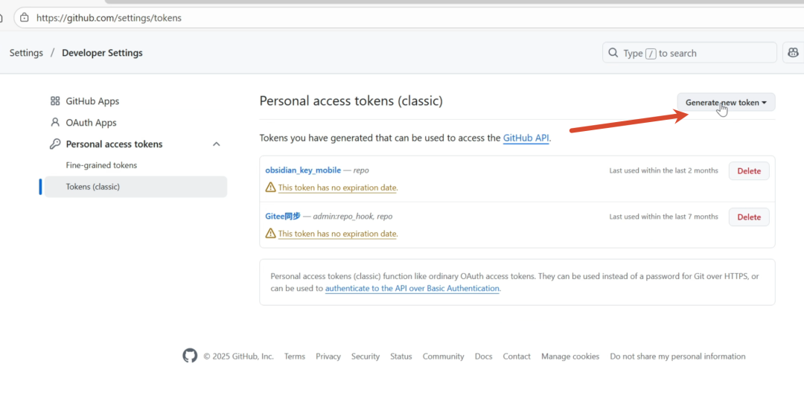

给 TOKEN 起一个名字，选择一个过期时间，这里我选择永不过期。然后我们把 repository 的权限勾选上。 我们把生成出来的这个 TOKEN 复制一下，保存好。然后回到手机这边粘贴过来，这样就配置成功了。

这里我在手机上新建一个测试笔记，我们可以等待一分钟，让它自动推送到 GitHub 上面。我们在 GitHub 的网页端，就能看到我们刚刚推送上来的文件。 在电脑版的 Obsidian 上面，笔记也能同步过来。这里有一点要注意的是，手机跟电脑最好不要同时编辑同一个文件，因为有可能会产生冲突。如果使用 git 同步文件的时候产生了冲突，我们需要手动解决一下。在网上也有很多这个方面的教程了，这里我就不赘述了。

## 导出

Obsidian 记录笔记虽然好用，怎么把它导出成 word 或者 html 格式呢？我们来到设置，第三方插件，社区插件，浏览，我们来安装这个插件 **Enhancing Export** 。 点击安装、启用。 选项里需要填写一个 pandoc 的路径。 这个 pandoc 就是一个文件格式转换工具。我们来到 GitHub Pandoc 的 releases 里面，下载对应操作系统的安装包。

https://github.com/jgm/pandoc/releases

然后把里面的可执行程序解压到电脑的一个目录下面。然后我们来到插件的设置页面，在 Pandoc 路径这里，把刚才复制的地址粘贴过来。

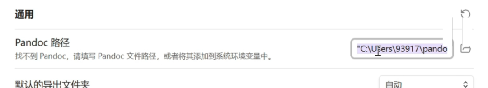

选择一篇笔记，右键就可以进行导出。 插件支持很多种格式的导出，这里我选择一个 word 格式的。这样我们就把笔记导出成了 word 格式，并且里面的配图也是正确的。

## 双向链接

Obsidian 另外一个强大的功能，就是它的双向链接与知识图谱。比如我们看这篇笔记：“我试用过上百款编程类的 MCP 工具”，在 MCP 这里我可以输入两对方括号，然后可以在这里面搜索另外一个笔记的标题。

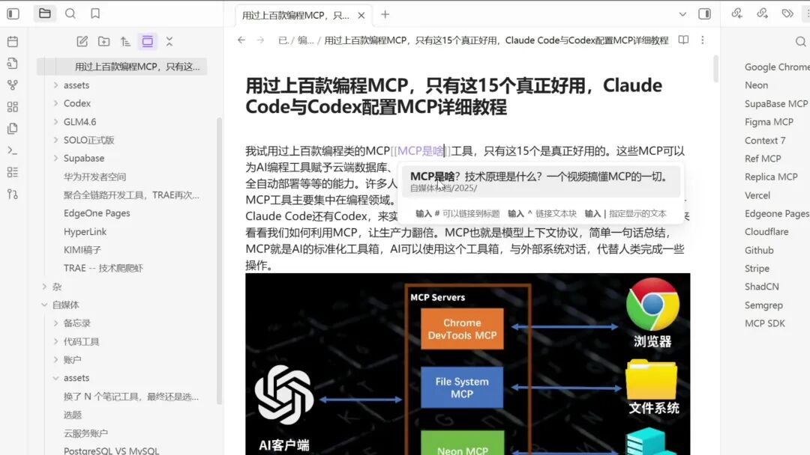按住 Ctrl 键打开这个链接，它就会打开一个新的 Tab 页，展示这篇笔记。 我们点击左侧的查看关系图谱，所有的笔记都会以一个小点的形式来平铺出来。 如果两个笔记之间做过关联，它们就会以一条线的形式连接出来。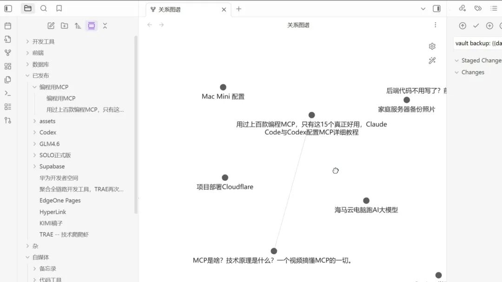用好这个功能，笔记之间的关系图谱会变得非常的炫酷复杂，可以帮助我们对知识进行高效的归纳整理，还能有助于帮我们发现笔记之间隐藏的关联，迸发出一些灵感。

本期视频就到这里，感谢大家点赞支持，我们下期再见。