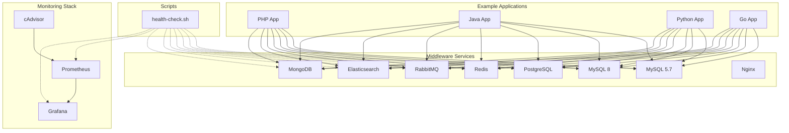

# feat: Docker 开发环境优化

## Overview

基于 Docker 的 Mac 开发环境优化，完善示例项目、添加自动化测试、改进监控运维，并增强文档使用指南。本项目将：

1. 为 PHP/Java/Python/Go 添加连接所有中间件的最小示例代码
2. 创建统一的健康检查脚本
3. 配置 Prometheus + Grafana + cAdvisor 核心监控栈
4. 完善 README 使用指南

---

## Problem Frame

当前 docker_env 项目存在以下缺口：

- **示例项目不完整**：examples/ 目录仅有 docker-compose.yml 配置，缺少实际应用代码和连接示例
- **无自动化测试**：各中间件虽有健康检查配置，但缺少统一的批量健康检查脚本
- **无监控运维**：缺少 Prometheus/Grafana 监控配置，无法实时观察容器资源使用情况
- **文档不够详细**：README 使用指南不够详细，新手可能遇到配置困难

---

## Requirements Trace

- R1. 为 PHP/Java/Python/Go 添加完整的中间件连接示例代码
- R2. 创建批量健康检查脚本，检查所有服务状态
- R3. 配置 Prometheus + Grafana + cAdvisor 监控栈
- R4. 完善 README 使用指南，包含详细步骤和常见问题
- R5. 示例项目需连接所有中间件（MySQL/Redis/PostgreSQL/RabbitMQ/Elasticsearch/MongoDB）

---

## Scope Boundaries

### In Scope

- 示例项目源代码（连接示例，非完整应用）
- 健康检查脚本
- Prometheus/Grafana/cAdvisor 配置
- README 文档完善

### Out of Scope

- PHP 8.2 支持延后至后续迭代
- 生产环境部署配置
- Alertmanager 告警配置
- CI/CD 流程

### Deferred to Follow-Up Work

- PHP 8.2 多版本支持（后续 PR）
- Alertmanager 告警通知配置
- 数据库自动备份脚本

---

## Context & Research

### Relevant Code and Patterns

| 模块 | 关键文件 | 模式 |
|------|---------|------|
| middleware | `middleware/docker-compose.yml` | YAML anchors、健康检查、资源限制 |
| local | `local/manage.sh` | Shell 脚本管理模式、交互式菜单 |
| examples | `examples/*/docker-compose.yml` | external 服务引用、shared-network |
| scripts | `scripts/init-network.sh` | 网络检查和创建模式 |

### Institutional Learnings

- 网络架构：使用 `shared-network` 实现容器间通信
- 端口安全：所有端口绑定到 `127.0.0.1`
- 凭据管理：统一在 `middleware/.env` 文件
- 命名约定：容器名使用服务名（如 `mysql57`、`redis`）

### External References

- [Prometheus Docker 配置](https://prometheus.io/docs/prometheus/latest/configuration/configuration/)
- [Grafana Provisioning](https://grafana.com/docs/grafana/latest/administration/provisioning/)
- [cAdvisor GitHub](https://github.com/google/cadvisor)
- [Docker 健康检查最佳实践](https://docs.docker.com/reference/dockerfile/#healthcheck)

---

## Key Technical Decisions

| 决策 | 理由 |
|------|------|
| 示例项目为最小连接示例 | 快速验证中间件连接，不引入复杂业务逻辑 |
| 监控使用核心栈（不含 Node Exporter） | 专注容器监控，简化部署 |
| 健康检查脚本使用 Shell | 与现有 scripts/ 目录风格一致 |
| Grafana Dashboard 使用导入 ID | 无需手写 JSON，推荐 ID 11600（Docker 容器监控） |

---

## Open Questions

### Resolved During Planning

- **示例项目深度**：所有中间件连接最小示例（MySQL/Redis/PostgreSQL/RabbitMQ/Elasticsearch/MongoDB）
- **监控范围**：核心监控栈（Prometheus + Grafana + cAdvisor）
- **PHP 版本策略**：延后至后续迭代

### Deferred to Implementation

- **各语言连接库版本**：实现时根据最新稳定版本确定
- **Grafana Dashboard 最终配置**：实现时可调整面板布局

---

## High-Level Technical Design

> *This illustrates the intended approach and is directional guidance for review, not implementation specification.*

### 整体架构



### 目录结构

```
docker_env/
├── middleware/
│   ├── monitoring/              # 新增
│   │   ├── docker-compose.yml
│   │   ├── prometheus/
│   │   │   └── prometheus.yml
│   │   └── grafana/
│   │       └── provisioning/
│   │           ├── datasources/
│   │           └── dashboards/
│   └── docker-compose.yml
├── examples/
│   ├── php/
│   │   └── src/                 # 新增
│   │       ├── public/
│   │       │   └── index.php
│   │       └── Dockerfile
│   ├── java/
│   │   └── src/                 # 新增
│   │       ├── src/main/java/
│   │       └── Dockerfile
│   ├── python/
│   │   └── src/                 # 新增
│   │       ├── app/
│   │       │   └── main.py
│   │       └── Dockerfile
│   └── go/
│   │   └── src/                 # 新增
│   │       ├── cmd/
│   │       │   └── main.go
│   │       └── Dockerfile
├── scripts/
│   ├── health-check.sh          # 新增
│   └── init-network.sh
└── README.md                    # 完善
```

---

## Implementation Units

### Phase 1: 示例项目完善

---

- U1. **PHP 示例项目**

**Goal:** 为 PHP 添加连接所有中间件的最小示例代码

**Requirements:** R1, R5

**Dependencies:** None

**Files:**
- Create: `examples/php/src/public/index.php`
- Create: `examples/php/src/Dockerfile`
- Create: `examples/php/src/README.md`
- Modify: `examples/php/docker-compose.yml`

**Approach:**
- 创建纯 PHP 连接示例（无框架依赖）
- 使用 PDO 连接 MySQL/PostgreSQL
- 使用 Redis 扩展连接 Redis
- 使用 AMQP 库连接 RabbitMQ
- 使用 Elasticsearch 官方客户端
- 使用 MongoDB 扩展连接 MongoDB
- 每个连接提供独立的测试页面

**Patterns to follow:**
- `examples/php/CLAUDE.md` 中的连接示例代码
- `middleware/docker-compose.yml` 的服务命名约定

**Test scenarios:**
- Happy path: 访问 `/mysql` 页面返回 MySQL 连接状态
- Happy path: 访问 `/redis` 页面返回 Redis ping 响应
- Happy path: 访问 `/postgres` 页面返回 PostgreSQL 连接状态
- Happy path: 访问 `/rabbitmq` 页面返回 RabbitMQ 连接状态
- Happy path: 访问 `/elasticsearch` 页面返回 ES 集群状态
- Happy path: 访问 `/mongodb` 页面返回 MongoDB 连接状态
- Error path: 中间件未启动时返回明确错误信息
- Integration: 容器启动后所有连接页面可正常访问

**Verification:**
- `docker-compose up` 后访问 http://127.0.0.1:8081 能显示连接状态页面
- 所有中间件连接测试通过

---

- U2. **Java 示例项目**

**Goal:** 为 Java 添加连接所有中间件的最小示例代码

**Requirements:** R1, R5

**Dependencies:** None

**Files:**
- Create: `examples/java/src/src/main/java/com/example/App.java`
- Create: `examples/java/src/src/main/resources/application.yml`
- Create: `examples/java/src/Dockerfile`
- Create: `examples/java/src/README.md`
- Create: `examples/java/src/pom.xml`
- Modify: `examples/java/docker-compose.yml`

**Approach:**
- 使用 Spring Boot 最小应用
- 配置多数据源连接 MySQL/PostgreSQL
- 使用 Spring Data Redis 连接 Redis
- 使用 Spring AMQP 连接 RabbitMQ
- 使用 Elasticsearch Java 客户端
- 使用 Spring Data MongoDB 连接 MongoDB
- 提供 REST API 端点测试各连接

**Patterns to follow:**
- `examples/java/CLAUDE.md` 中的连接示例
- Spring Boot 微服务架构模式

**Test scenarios:**
- Happy path: GET `/health/mysql` 返回 MySQL 连接状态
- Happy path: GET `/health/redis` 返回 Redis ping 响应
- Happy path: GET `/health/postgres` 返回 PostgreSQL 连接状态
- Happy path: GET `/health/rabbitmq` 返回 RabbitMQ 连接状态
- Happy path: GET `/health/elasticsearch` 返回 ES 状态
- Happy path: GET `/health/mongodb` 返回 MongoDB 连接状态
- Error path: 服务依赖未启动时返回 503 状态
- Integration: 容器启动后所有健康检查端点正常响应

**Verification:**
- `docker-compose up` 后 GET http://127.0.0.1:8080/actuator/health 返回 UP 状态
- 各中间件健康检查端点返回正常

---

- U3. **Python 示例项目**

**Goal:** 为 Python 添加连接所有中间件的最小示例代码

**Requirements:** R1, R5

**Dependencies:** None

**Files:**
- Create: `examples/python/src/app/main.py`
- Create: `examples/python/src/app/config.py`
- Create: `examples/python/src/app/routes/health.py`
- Create: `examples/python/src/requirements.txt`
- Create: `examples/python/src/Dockerfile`
- Create: `examples/python/src/README.md`
- Modify: `examples/python/docker-compose.yml`

**Approach:**
- 使用 FastAPI 最小应用
- 使用 SQLAlchemy 连接 MySQL/PostgreSQL
- 使用 redis-py 连接 Redis
- 使用 pika 连接 RabbitMQ
- 使用 elasticsearch-py 连接 ES
- 使用 pymongo 连接 MongoDB
- 提供 REST API 端点测试各连接

**Patterns to follow:**
- `examples/python/CLAUDE.md` 中的连接示例
- FastAPI 路径操作模式

**Test scenarios:**
- Happy path: GET `/health/mysql` 返回 MySQL 连接状态
- Happy path: GET `/health/redis` 返回 Redis ping 响应
- Happy path: GET `/health/postgres` 返回 PostgreSQL 连接状态
- Happy path: GET `/health/rabbitmq` 返回 RabbitMQ 连接状态
- Happy path: GET `/health/elasticsearch` 返回 ES 状态
- Happy path: GET `/health/mongodb` 返回 MongoDB 连接状态
- Error path: 依赖服务未启动时返回错误响应
- Integration: 容器启动后所有健康检查端点正常响应

**Verification:**
- `docker-compose up` 后 GET http://127.0.0.1:8000/health 返回正常状态
- 各中间件健康检查端点返回正常

---

- U4. **Go 示例项目**

**Goal:** 为 Go 添加连接所有中间件的最小示例代码

**Requirements:** R1, R5

**Dependencies:** None

**Files:**
- Create: `examples/go/src/cmd/main.go`
- Create: `examples/go/src/internal/handlers/health.go`
- Create: `examples/go/src/internal/config/config.go`
- Create: `examples/go/src/go.mod`
- Create: `examples/go/src/go.sum`
- Create: `examples/go/src/Dockerfile`
- Create: `examples/go/src/README.md`
- Modify: `examples/go/docker-compose.yml`

**Approach:**
- 使用 Gin 最小应用
- 使用 database/sql 连接 MySQL/PostgreSQL
- 使用 go-redis 连接 Redis
- 使用 amqp091-go 连接 RabbitMQ
- 使用 elasticsearch-go 连接 ES
- 使用 mongo-driver 连接 MongoDB
- 提供 REST API 端点测试各连接

**Patterns to follow:**
- `examples/go/CLAUDE.md` 中的连接示例
- Go 模块化项目结构

**Test scenarios:**
- Happy path: GET `/health/mysql` 返回 MySQL 连接状态
- Happy path: GET `/health/redis` 返回 Redis ping 响应
- Happy path: GET `/health/postgres` 返回 PostgreSQL 连接状态
- Happy path: GET `/health/rabbitmq` 返回 RabbitMQ 连接状态
- Happy path: GET `/health/elasticsearch` 返回 ES 状态
- Happy path: GET `/health/mongodb` 返回 MongoDB 连接状态
- Error path: 依赖服务未启动时返回错误响应
- Integration: 容器启动后所有健康检查端点正常响应

**Verification:**
- `docker-compose up` 后 GET http://127.0.0.1:8082/health 返回正常状态
- 各中间件健康检查端点返回正常

---

### Phase 2: 自动化测试

---

- U5. **健康检查脚本**

**Goal:** 创建统一的批量健康检查脚本

**Requirements:** R2

**Dependencies:** U1, U2, U3, U4 (示例项目可作为测试对象)

**Files:**
- Create: `scripts/health-check.sh`

**Approach:**
- 使用 Shell 脚本风格与现有 scripts/ 一致
- 支持交互式菜单和命令行模式
- 检查内容：容器健康状态、网络连接、资源使用
- 提供彩色输出和 JSON 输出两种格式
- 支持 `--no-color` 参数

**Patterns to follow:**
- `local/manage.sh` 的脚本结构
- `middleware/docker-compose.yml` 的健康检查配置

**Test scenarios:**
- Happy path: 所有服务健康时返回退出码 0
- Error path: 存在不健康服务时返回退出码 1
- Edge case: 服务处于 starting 状态时返回退出码 2
- Happy path: `--json` 参数输出 JSON 格式结果
- Happy path: `--no-color` 参数禁用彩色输出
- Integration: 配合 cron 定时执行并记录日志

**Verification:**
- `./scripts/health-check.sh` 执行后显示所有服务健康状态
- 不健康服务时脚本退出码为 1

---

### Phase 3: 监控运维

---

- U6. **Prometheus/Grafana/cAdvisor 配置**

**Goal:** 配置核心监控栈

**Requirements:** R3

**Dependencies:** None

**Files:**
- Create: `middleware/monitoring/docker-compose.yml`
- Create: `middleware/monitoring/prometheus/prometheus.yml`
- Create: `middleware/monitoring/grafana/provisioning/datasources/prometheus.yml`
- Create: `middleware/monitoring/grafana/provisioning/dashboards/dashboard.yml`
- Modify: `middleware/.env.example` (添加监控凭据)

**Approach:**
- Prometheus 配置抓取 cAdvisor 和自身指标
- Grafana 配置自动数据源和 Dashboard 导入
- cAdvisor 挂载 Docker socket 和系统路径
- 所有服务加入 shared-network
- 端口绑定到 127.0.0.1

**Patterns to follow:**
- `middleware/docker-compose.yml` 的服务配置模式
- YAML anchors 复用配置

**Test scenarios:**
- Happy path: Prometheus UI 可访问 http://127.0.0.1:9090
- Happy path: Grafana UI 可访问 http://127.0.0.1:3000
- Happy path: cAdvisor UI 可访问 http://127.0.0.1:8081
- Happy path: Prometheus 成功抓取 cAdvisor 指标
- Happy path: Grafana Dashboard 显示容器监控数据
- Integration: 监控服务与 middleware 服务在同一网络

**Verification:**
- `docker-compose up` 后 Prometheus targets 页面显示 cAdvisor 状态 UP
- Grafana Dashboard ID 11600 显示容器 CPU/内存/网络数据

---

### Phase 4: 文档完善

---

- U7. **README 使用指南完善**

**Goal:** 完善 README 使用指南，包含详细步骤和常见问题

**Requirements:** R4

**Dependencies:** U1-U6 (所有功能完成后完善文档)

**Files:**
- Modify: `README.md`
- Modify: `CLAUDE.md` (同步更新)

**Approach:**
- 添加详细的快速开始指南（分步骤）
- 添加各中间件连接示例汇总表
- 添加监控服务使用说明
- 添加健康检查脚本使用说明
- 扩展 FAQ 章节，覆盖常见配置问题
- 添加目录结构说明

**Patterns to follow:**
- 现有 README.md 的结构
- 各模块 CLAUDE.md 的详细程度

**Test scenarios:**
- Happy path: 新用户按 README 快速开始指南成功启动所有服务
- Happy path: FAQ 覆盖常见配置错误（如 .env 文件未创建）
- Integration: README 与实际配置保持一致

**Verification:**
- README 包含完整的快速开始指南
- FAQ 章节覆盖至少 10 个常见问题

---

## System-Wide Impact

- **网络架构**：监控服务加入 shared-network，与现有中间件服务通信
- **端口占用**：新增端口 9090 (Prometheus)、3000 (Grafana)、8081 (cAdvisor)
- **凭据管理**：.env 文件新增 GRAFANA_ADMIN_USER 和 GRAFANA_ADMIN_PASSWORD
- **启动顺序**：建议先启动 middleware，再启动 monitoring，最后启动 examples

---

## Risks & Dependencies

| 风险 | 缓解措施 |
|------|---------|
| cAdvisor 在 Mac 上权限问题 | 使用 `privileged: true` 和正确的挂载路径 |
| Grafana Dashboard 导入失败 | 提供手动导入步骤作为备选 |
| 示例项目依赖版本冲突 | 使用最新稳定版本，明确版本号 |
| 端口冲突 | 所有端口绑定到 127.0.0.1，明确列出端口表 |

---

## Phased Delivery

### Phase 1 (示例项目)
- U1, U2, U3, U4 并行实施
- 每个语言独立验证

### Phase 2 (自动化测试)
- U5 健康检查脚本
- 依赖 Phase 1 示例项目作为测试对象

### Phase 3 (监控运维)
- U6 Prometheus/Grafana/cAdvisor
- 可独立实施，不依赖 Phase 1

### Phase 4 (文档完善)
- U7 README 完善
- 依赖所有功能完成

---

## Documentation Plan

- 更新根级 README.md：快速开始指南、端口表、监控使用说明
- 更新根级 CLAUDE.md：同步新增功能说明
- 各示例项目 README.md：连接示例使用说明
- 监控模块 README.md：监控配置说明

---

## Sources & References

- **Origin document**: 本计划基于项目初始化后的"推荐下一步"
- **相关代码**: `middleware/docker-compose.yml`, `local/manage.sh`
- **外部文档**: Prometheus/Grafana/cAdvisor 官方文档
- **Dashboard ID**: 11600 (Docker Container Monitoring)